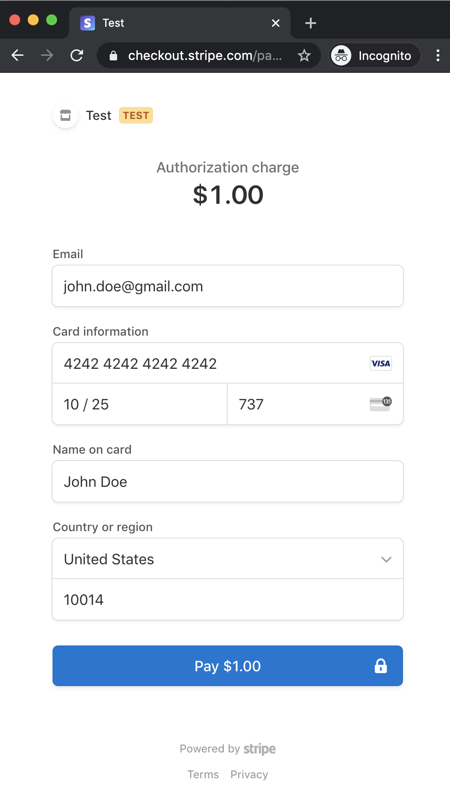

Kill Bill Stripe demo
=====================

Inspired from the official [Using Checkout and Sinatra](https://stripe.com/docs/checkout/sinatra) guide, this sample app shows you how to integrate Stripe tokenization feature with [Kill Bill subscriptions APIs](https://docs.killbill.io/latest/userguide_subscription.html).

We also provide an [end-to-end tutorial](https://docs.killbill.io/latest/stripe_plugin.html) that explains how this application can be used with Kill Bill.

Prerequisites
-------------

* Kill Bill is [already setup](https://docs.killbill.io/latest/getting_started.html)
* The default tenant (bob/lazar) has been created
* The default tenant has a `Sports` product, with a trial phase
* The [Stripe plugin](https://github.com/killbill/killbill-stripe-plugin) is installed and configured

Set up
------

Ruby 2.1+ or JRuby 1.7.20+ is recommended. If you do not have a Ruby installation yet, use [RVM](https://rvm.io/rvm/install) to install Ruby:

```
gpg --keyserver hkp://keys.gnupg.net --recv-keys 409B6B1796C275462A1703113804BB82D39DC0E3
\curl -sSL https://get.rvm.io | bash -s stable --ruby
```

Windows users may use [Ruby Installer](https://rubyinstaller.org/) to install Ruby.

After following the post-installation instructions, you should have access to the ruby and gem executables.

Install the dependencies by running in this folder:

```
gem install bundler
bundle install
```

Run
---

To run the app:

```
PUBLISHABLE_KEY=<YOUR_PUBLISHABLE_STRIPE_KEY> ruby app.rb
```

Docker Image
---
We also provide a Docker image for this demo application. To pull the image and run the demo application in a docker container, run the following commands:

```
docker pull killbill/stripe-demo
```

```
docker run -e PUBLISHABLE_KEY=<YOUR_PUBLISHABLE_STRIPE_KEY> -e KB_URL=http://host.docker.internal:8080 -ti -p4567:4567 killbill/stripe-demo
```

Test 
----

Go to [http://localhost:4567/](http://localhost:4567/) where you should see both the Stripe Checkout button and the Stripe Elements button highlighting two integration methods.

Enter dummy data (4242 4242 4242 4242 as the credit card number, any three digit CVC and any expiry date in the future work) and complete one of the two checkout processes.

This will:

* Tokenize the card in Stripe
* Create a new Kill Bill account
* Add a default payment method on this account associated with this token (a customer object is also created in Stripe, so the token can be re-used)
* Create a new subscription for the sports car monthly plan (with a $10 30-days trial)
* Charge the token for $10



